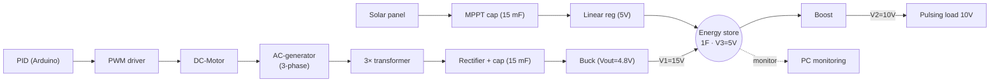

# 62768 — Electrical Energy System

Team project for **62768 Electrical Energy Systems** (DTU, June 2026, 3-week course).
We design and build a complete electrical energy system per the course requirement spec
(*Kravspecifikation*), from idea to a working functional model (CDIO).

## Team

| Name | GitHub | Role / area |
|------|--------|-------------|
| Mads Rudolph | @MadsRudolph | |
| _teammate_ | | |
| _teammate_ | | |
| _teammate_ | | |
| _teammate_ | | |
| _teammate_ | | |

## System overview

**Key targets:** V1 = 15 V ±1 V (≥300 mA to buck) · V2 = 10 V ±1 V (≥150 mA) · V3 = 5 V ±0.5 V.
Converters and current sensing must use **discrete components** (op-amps allowed; no integrated converter ICs).
Full requirement list lives in the course spec (see `docs/`).

## Repository layout

| Folder | Contents |
|--------|----------|
| `firmware/` | Arduino code — PID control, ADC, timer/PWM, monitoring |
| `simulation/` | Simulink models (`.slx`) + parameter scripts (`.m`) |
| `hardware/schematics/` | Circuit schematics |
| `hardware/bom/` | Bill of materials |
| `docs/` | Report, design notes; `docs/datasheets/` for component PDFs |
| `measurements/` | Lab/test data (csv, xlsx) |

## Getting started

- **Firmware:** Arduino IDE (or PlatformIO). Boards used: Arduino + (optionally) TI LAUNCHXL-F28027.
- **Simulation:** MATLAB/Simulink — open `.slx` models in `simulation/`, run the `Parameters*.m` scripts first to load workspace variables.

## Workflow (6-person team)

- **Branch per feature/task:** `git checkout -b firmware/pid-loop` (or `sim/...`, `hw/...`, `docs/...`).
- **Pull request into `main`** — keep `main` always working. Ask one teammate to review before merge.
- **Commit small and often**, with clear messages. Pull before you push.
- **Avoid committing binaries that change every save** — `.gitignore` already excludes MATLAB/Arduino build artifacts.
- Heavy binary files (videos, big captures): link from a shared drive instead of committing.

## Course

- DTU 62768, June 2026 · groups of up to 6 · assessment = report + functional model.
- Lab: V1.01-04 · Lecturers: Ashraf, Sam, Audrey.
