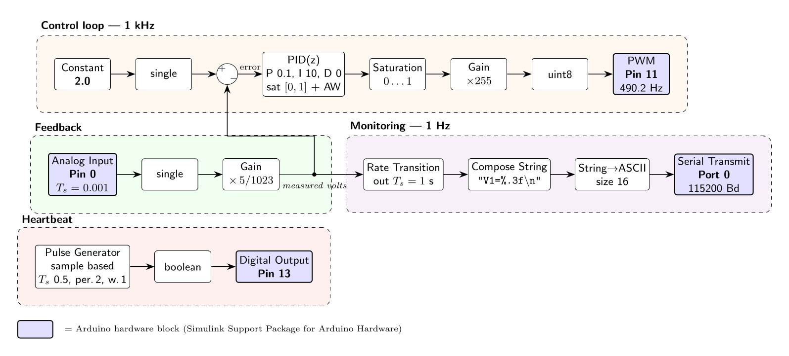
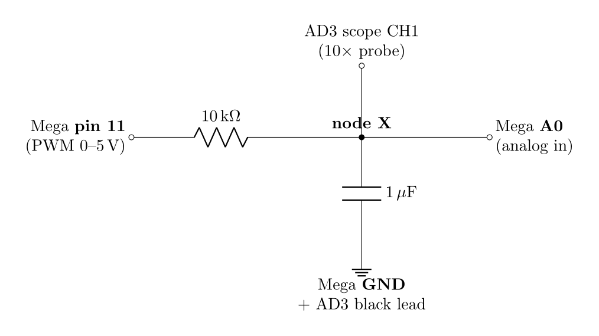

# Lab guide — building `MegaV1Control.slx`

Extends the verified PI loop (`MegaPI.slx`) into its firmware shape:
**control @ 1 kHz + heartbeat LED + 1 Hz serial monitoring** — still running
against the RC bench plant.

> [!NOTE]
> **Measurement roles:** 🔬 = **you** measure (WaveForms / eyes) · 🤖 = **Claude**
> measures (close WaveForms, say *"check"* — only one app can own the AD3 at a time).
> The AD3 probe is **10×** — keep the channel attenuation at 10× in WaveForms.

## The target — what you're building

Four islands on one canvas: the control loop (the verified `MegaPI` chain), the
feedback path it shares with the new monitoring branch, and the heartbeat.
Blue blocks come from *Simulink Support Package for Arduino Hardware → Common*.

## The bench plant (already wired)

> [!WARNING]
> If you rebuild the breadboard: re-verify **open-loop first** (fixed duty 128 →
> node X ≈ 2.5 V) before trusting any closed-loop result. An open resistor link cost
> us an evening on the C2000 — the ADC happily reads a *very* convincing phantom
> voltage on a floating pin.

---

## ✅ Checkpoint 0 — starting state

- [ ] Board on COM9, RC plant wired, probe on **node X**, AD3 GND on Mega GND
- [ ] 🔬 *or* 🤖: node X reads the last deployed setpoint (2.0 or 3.5 V) — loop alive

---

## Step 0 — Save As

- [ ] Open `MegaPI.slx` → **Save As** → `MegaV1Control.slx` (same `MEGA/` folder)

> [!TIP]
> `MegaPI.slx` stays untouched as the known-good fallback. If tonight goes sideways,
> you can always redeploy it and be back at a working loop in 30 seconds.

## Step 1 — Heartbeat (bottom of the canvas — it's infrastructure)

- [ ] **Pulse Generator**: *Sample based*, Sample time `0.5`, Period `2`, Pulse width `1`
- [ ] → **Data Type Conversion** to `boolean` → **Digital Output** (Arduino lib), Pin **13**

> [!TIP]
> From now on: dark LED = scheduler dead. The cheapest diagnostic of the whole project.

## Step 2 — Serial speed

- [ ] Ctrl+E → Hardware Implementation → Target hardware resources →
  **Serial port properties → Serial 0 baud rate = 115200**

## Step 3 — Monitoring branch (the 1 kHz → 1 Hz boundary + strings)

Branch off the **measured volts** signal (output of the 5/1023 gain, see diagram):

- [ ] **Rate Transition** (Signal Attributes): ✔ deterministic, **Output sample time = 1**
- [ ] → **Compose String** (Simulink → String): format `"V1=%.3f\n"`, 1 input
- [ ] → **String to ASCII**: output vector size **16**
- [ ] → **Serial Transmit** (Arduino lib): **Port 0**

> [!IMPORTANT]
> The control loop must never wait for printing — that is exactly what the Rate
> Transition guarantees. Without it, Simulink would either error on mixed rates or,
> worse, drag string formatting into the 1 ms control task on an 8-bit CPU.

> [!NOTE]
> String-to-ASCII pads its fixed 16-byte output with `NUL`s, so the stream carries a
> few zero bytes between lines. Terminals hide them; parsers strip them. Cosmetic.

## Step 4 — Pre-deploy sanity

- [ ] Ref constant = **2.0**
- [ ] PID: P `0.1`, I `10`, D `0` — Saturation tab: **output [0,1] AND integrator [0,1]**, clamping
- [ ] **Ctrl+D** (Update Diagram) runs clean — fix sample-time complaints with `-1` on the
  offending block; the Rate Transition rules the monitoring branch
- [ ] **Build, Deploy & Start**

> [!CAUTION]
> Watch the diagnostics pane for **red** before celebrating. A failed build leaves the
> *previous* firmware running — you'll be debugging a ghost. (Learned twice today.)

---

## ✅ Checkpoint 1 — life signs (free, instant)

- [ ] 🔬 Heartbeat LED on pin 13 blinks at 1 Hz
- [ ] 🔬 RX/TX LEDs flicker briefly every second (the serial transmit firing)

## ✅ Checkpoint 2 — control + monitoring together

- [ ] **Close WaveForms**, don't open any serial monitor (COM9 belongs to Claude now)
- [ ] 🤖 say **"check"** → Claude verifies *simultaneously*:
  - node X = **2.000 V** on the AD3 (discard-first-capture rule applies)
  - COM9 streams `V1=2.00x` once per second at 115200

Both green = the Mega's entire project job description, working in miniature.

## ✅ Checkpoint 3 — step response (the report figure)

- [ ] Change ref to **3.5**, redeploy
- [ ] 🔬 WaveForms: trigger **Normal / rising / level 1 V**, ~50 ms/div — the deploy reset
  makes the node climb 0 → 3.5 V right after flashing; **screenshot the transient** →
  `measurements/`
- [ ] Expect a smooth ~100 ms rise, no overshoot (P=0.1 / I=10 → ~8 Hz crossover, ~90° PM)

## ✅ Checkpoint 4 (bonus) — disturbance rejection

- [ ] 🔬 While regulating: clip a second **10 kΩ from node X to GND** — the node dips and
  the integrator drags it back. Capture it; classic PI demo for the report.

---

## Wrap-up

- [ ] Commit `MegaV1Control.slx` + screenshots (Claude does the log + commit)
- [ ] Next model: MPPT P&O skeleton (A6/A7 → D5) once the supervisor answers the
  *discrete vs Arduino MPPT* question — see [mega-pinmap.md](../mega-pinmap.md) open questions
