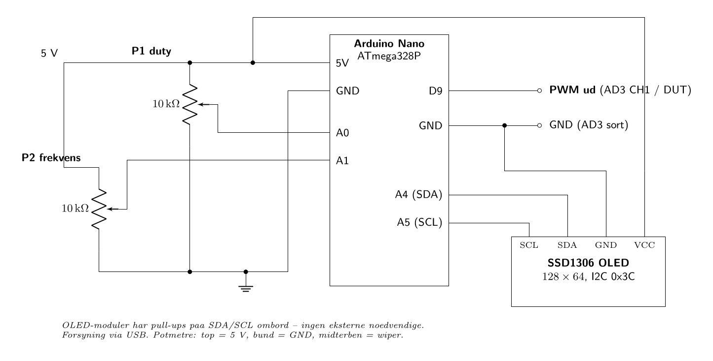

# PWM-testrig — Arduino Nano

Lille bench-instrument: to potmetre sætter **frekvens** og **duty cycle** på en
PWM-udgang (D9), og de faktiske værdier vises på en SSD1306 OLED. Tænkt som
stimulus/testkilde sammen med AD3'en, fx til gate-drev og konverter-test.

Bare-metal AVR C (ingen Arduino-framework), samme stil som resten af `firmware/`.



## Specifikationer

| Ting               | Værdi                                                          |
| ------------------ | -------------------------------------------------------------- |
| PWM-udgang         | **D9** (OC1A, Timer1, 16-bit) — 0–5 V logik                    |
| Frekvens (P2 → A1) | **100 Hz – 50 kHz**, pseudo-logaritmisk (tre dekade-segmenter) |
| Duty (P1 → A0)     | **0–100 %** (0 % og 100 % giver ægte konstant lav/høj)         |
| Display            | SSD1306 128×64, I2C adresse **0x3C** (0x3D: ret `config.h`)    |
| Opdatering         | ~10 Hz, med dødbånd så ADC-støj ikke flimrer                   |

Displayet viser den **faktiske** (timer-kvantiserede) frekvens — ikke ønskeværdien.
Riggen kører videre uden display (I2C-laget har timeout).

## Byg & flash (PlatformIO)

```bash
cd firmware/pwm-testrig
pio run                       # byg (klon-Nano = default)
pio run -t upload             # flash via USB (CH340, gammel bootloader)
pio run -e nano_new -t upload # original Nano / ny bootloader
```

> **Klon-note:** CH340-kloner bruger næsten altid den gamle bootloader (57600
> baud) = `nano_old` (default). Fejler upload med sync-fejl, så prøv `nano_new`.

## Filer

| Fil | Rolle |
|---|---|
| `include/config.h` | Pins, frekvensområde, I2C-adresse, dødbånd |
| `src/pwm.c` | Timer1 Fast PWM (mode 14): ICR1 = frekvens, OCR1A = duty, auto-prescaler |
| `src/adc.c` | Polled ADC med 8× midling |
| `src/i2c.c` | Minimal TWI-master (400 kHz, write-only, med timeout) |
| `src/ssd1306.c` | OLED-driver uden framebuffer (window + stream), 1× og 2× font |
| `src/main.c` | Pot-mapping, hysterese, displaylayout |

## Verifikation med AD3

Sæt scope CH1 på **PWM ud** og sort til **GND**-bøsningen, og sammenlign
WaveForms' frekvens/duty-måling med displayet. Husk 10×-probe-indstillingen.
Automatiseret: `python tools/ad3/ad3_check.py measure --attenuation 10
--expect-freq <displayværdi> --expect-duty <displayværdi>`.
