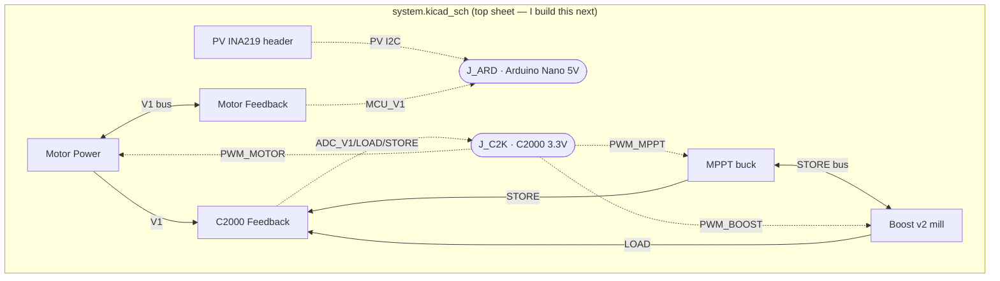

# How to build the connected system hierarchical schematic

Hands-on procedure for wiring the **5 real boards** into one netlist-connected
`system.kicad_sch`. It pairs with the design contract in
[`docs/superpowers/specs/2026-06-27-system-integrated-pcb-interface-contract.md`](../../../docs/superpowers/specs/2026-06-27-system-integrated-pcb-interface-contract.md)
— that file says *what* connects to what; this file says *exactly how to do it in KiCad*.

> **This supersedes earlier versions of this guide.** The board set is **5 boards**
> (mppt→**mppt_buck**, **c2000_feedback** added, discrete **current_sense dropped** — current
> sensing is a single PV **INA219** added at the top sheet). MCU is **split**: Arduino Nano
> (5 V, sensing + MPPT P&O) + TI C2000 (3.3 V, all PID). See the contract.

**Your job is the label-placement phase only** (placing hierarchical labels on each board,
by hand in the GUI). Building the top sheet + ERC is scripted — ping me when you're done and
I'll generate the top sheet from the labels you placed.

---

## The big picture

Each board becomes a **sheet** in the top schematic. A net you want to expose to the top
sheet gets a **hierarchical label** inside the board; that label automatically becomes a
**sheet pin** on the board's box in the top sheet, which I then wire up.

---

## Background: hierarchical label vs sheet pin (30-second version)

- A **hierarchical label** lives *inside* a sub-sheet (a board). Its **name** is the
  contract — `STORE`, `V1`, `GND`, etc.
- When that board is dropped into the top sheet, KiCad imports each hierarchical label as a
  **sheet pin** on the board's rectangle.
- I wire the sheet pins together at the top level (e.g. `mppt_buck:STORE` ↔ `boost_v2:STORE`).
- **The names must match exactly**, including case. `+5V` ≠ `+5v`. Copy the names from the
  tables below verbatim.

You do **not** rename existing nets. A net can carry both its current label *and* a new
hierarchical label — they merge into the same net. The hierarchical label is just the
"export this net to the top sheet" tag.

---

## Before you start

1. **Use KiCad 10.** Open each board through its **`.kicad_pro`** (not the bare `.kicad_sch`)
   so the project rules load.
2. **One board at a time.** Finish a board, save, run ERC, close it.
3. Boards in KiCad-9 format (**mppt_buck, boost_v2_mill, c2000_feedback**) will prompt to
   **upgrade the format on save — say yes.** The big reformatting diff is expected, not
   corruption. (motor_power and motor_feedback are already KiCad 10.)
4. **c2000_feedback was just reworked** (3 voltage channels only — no current channels, no
   PWM pass). If you have it open, reload before labelling.

---

## The mechanic: placing one hierarchical label

1. **Place ▸ Add Hierarchical Label** (hotkey **`H`** — confirm in the Place menu).
2. Type the **exact label name** from the board's table below.
3. Set **Shape** to the table value (Input / Output / Bidirectional / Passive). It only sets
   the sheet-pin arrow direction. Use **Passive** for `GND`/power nets.
4. Drop the label **directly on the target net's wire** so its anchor square touches the wire
   (green connection dot, not a floating square). If a pin has no wire stub, draw a short wire
   off it first (hotkey **`W`**), then attach the label.
5. **Save** (`Ctrl+S`).

---

## Per-board label tables

Place exactly these labels on each board. Names are **case-sensitive** — type as written.

### 1. motor_power  (`boards/motor_power/motor_power.kicad_sch`) — 10 labels
Interface nets are mostly auto-named (`Net-(Jx-Pin_n)`), so anchor by **connector pin**.

| Where (connector · existing net) | Label name | Shape |
|---|---|---|
| J1 pin 1 · "PWM fra MCU" (`Net-(J1-Pin_1)`) | `PWM_MOTOR` | Input |
| J2 pin 1 · "MCP PWM" (`Net-(J2-Pin_1)`) | `PWM_MOTOR_ALT` | Input |
| J3 motor + · `+15V1` | `MOTOR_A` | Output |
| J3 motor − · `Net-(D4-A)` | `MOTOR_B` | Output |
| J4 / J5 three phase nodes (3 wires) | `3PH_U` / `3PH_V` / `3PH_W` | Bidirectional |
| `V1` net (J6 pin 2 / J7 pin 1) | `V1` | Output |
| `GND` | `GND` | Passive |
| `+5v` (J7 pin 3) | `+5V_PWR` | Input |

### 2. motor_feedback  (`boards/motor_feedback/motor_feedback.kicad_sch`) — 6 labels
Two domains: **power side** (J1) vs **MCU side** (J3). Keep them distinct.

| Where (connector pin · net) | Label name | Shape |
|---|---|---|
| J1 pin 1 · `V1` | `V1` | Input |
| J1 pin 2 · `GND` | `GND` | Passive |
| J1 pin 3 · `+5V` | `+5V_PWR` | Input |
| J3 pin 1 · `MCU` | `MCU_V1` | Output |
| J3 pin 2 · `GND_MCU` | `GND_MCU` | Passive |
| J3 pin 3 · `+5V_MCU` | `+5V_MCU` | Input |

### 3. mppt_buck  (`boards/mppt_buck/mppt_buck.kicad_sch`) — 6 labels
Switching MPPT (replaces the old linear `mppt`). Nets are existing global labels — land on them.

| Where (existing global label) | Label name | Shape |
|---|---|---|
| `VPV` (J1 pin 1, PV in via INA219) | `PV_BUCK_IN` | Input |
| `VOUT_5V` (J2 pin 1) | `STORE` | Output |
| `PWM` (J3 pin 1) | `PWM_MPPT` | Input |
| `GND_MCU` (J3 pin 2) | `GND_MCU` | Passive |
| `+15V` (J4 pin 1) | `+15V_GATE` | Input |
| `GND` | `GND` | Passive |

*(The `SW` switch node is a probe point — I add that test point on this sheet later; no label needed.)*

### 4. boost_v2_mill  (`boards/boost/boost_v2_mill/boost_v2_mill.kicad_sch`) — 6 labels
Use **boost_v2_mill** (the mill copy you're milling). Nets are existing global labels.

| Where (existing global label) | Label name | Shape |
|---|---|---|
| `VIN_5V` (J1 pin 1) | `STORE` | Input |
| `VOUT_V2` (J2 pin 1) | `LOAD` | Output |
| `PWM` (J3 pin 1) | `PWM_BOOST` | Input |
| `GND_MCU` (J3 pin 2) | `GND_MCU` | Passive |
| `+15V` (J4 pin 1) | `+15V_GATE` | Input |
| `GND` | `GND` | Passive |

### 5. c2000_feedback  (`boards/c2000_feedback/c2000_feedback.kicad_sch`) — 8 labels
Reworked board: 3 voltage dividers → C2000 ADC. Land on the existing net wires.

| Where (existing net) | Label name | Shape |
|---|---|---|
| `V1IN` (J1 pin 1) | `V1` | Input |
| `V2IN` (J3 pin 1) | `LOAD` | Input |
| `V3IN` (J5 pin 1) | `STORE` | Input |
| `ADCV1` (J4 pin 1) | `ADC_V1` | Output |
| `ADCV2` (J4 pin 2) | `ADC_LOAD` | Output |
| `ADCV3` (J4 pin 3) | `ADC_STORE` | Output |
| `+3V3` (J2 pin 1) | `+3V3` | Input |
| `GND` (J2 pin 2) | `GND` | Passive |

> **Note — C2000 ground = power `GND`.** The dividers measure power-GND-referenced rails
> (V1/LOAD/STORE), so the C2000's analog reference must be power `GND` (label it `GND`, not
> `GND_MCU`). `GND` and `GND_MCU` meet at a single star tie at the top level (I place that).

**Total: 36 labels across 5 boards.**

---

## Verify each board before moving on

1. **Eyeball:** every label present and sitting on a wire (green dot, not a floating square).
2. **ERC** (*Inspect ▸ Electrical Rules Checker ▸ Run ERC*): you will get **one error per
   hierarchical label** — *"Hierarchical label 'X' in root sheet cannot be connected to
   non-existent parent sheet."* **This is EXPECTED and benign** — a hierarchical label hands a
   net up to a parent sheet, and a board opened standalone has no parent yet. These all clear
   automatically once the board becomes a sub-sheet of `system.kicad_sch`. Use the error list
   as a **checklist**: the number of these errors should equal the number of labels in the
   board's table (e.g. motor_power → 10). If one is missing, that label wasn't placed (or
   missed its wire). A *different* error ("label not connected to anything") means a label is
   floating off its wire — nudge it on. Other benign noise: `lib_symbol_mismatch`, single-pin
   "not connected".
3. **Save** (accept the KiCad-10 format upgrade for the KiCad-9 boards).

---

## Gotchas (the ones that actually cost time)

- **Case sensitivity.** `+5V` ≠ `+5v`. Type names exactly. (motor_power uses lowercase `+5v`;
  others use `+5V` — fine, they connect at the top sheet through the contract.)
- **The anchor must touch the wire.** A label 0.5 mm off the wire is a floating label. Zoom in.
- **Don't rename existing nets.** Add the hierarchical label alongside; both names = same net.
- **`GND_MCU` only where the contract says.** It belongs on motor_feedback's MCU side and the
  boost/mppt **PWM opto** pins (J3 pin 2) — **not** on c2000_feedback (that's power `GND`).
  Don't tie `GND` and `GND_MCU` together on any board; I join them at one star point up top.
- **Global labels already on boost_v2 / mppt_buck.** Leave them; the hierarchical label is
  what creates the sheet pin. Any global-label bleed between sheets is a top-sheet cleanup
  I'll handle.

---

## What happens after you finish (so you know where this is going)

**Top sheet (I script this).** I rebuild `system.kicad_sch` with 5 sheet symbols, import the
sheet pins from your labels, and wire them per the contract: the **V1 bus**
(motor_power ↔ motor_feedback ↔ c2000_feedback), the **STORE bus**
(mppt_buck ↔ boost_v2_mill ↔ c2000_feedback), the **LOAD** tap (boost_v2_mill → c2000_feedback),
two MCU connectors — **J_ARD** (Arduino: MCU_V1, PV INA219 I2C, PWM_MPPT out, +5V) and **J_C2K**
(C2000: ADC_V1/LOAD/STORE, EPWM→PWM_MOTOR/BOOST) — the **PV INA219 header** (in-line on the
PV path), plus external terminals (`3PH_U/V/W`, `MOTOR_A/B`, `PV_PLUS/PV_RET`, `STORE` supercap,
`LOAD`, `+15V_GATE`, `+5V`), the diagnostic probe points, the single GND↔GND_MCU star tie, and
`PWR_FLAG`s on externally-fed rails.

**Verify.** Hierarchical ERC to **0 errors**; confirm `V1` ≠ `STORE` ≠ `LOAD` (independent
buses) and `GND` ≠ `GND_MCU` except at the one star tie, and that every sheet pin is wired.

**When you finish a board (or all five), tell me** and I'll read the labels straight out of the
`.kicad_sch` to confirm they landed, then generate the top sheet.

---

## Quick checklist

- [ ] motor_power — 10 labels, ERC 0, saved
- [ ] motor_feedback — 6 labels, ERC 0, saved
- [ ] mppt_buck — 6 labels, ERC 0, saved (format upgraded)
- [ ] boost_v2_mill — 6 labels, ERC 0, saved (format upgraded)
- [ ] c2000_feedback — 8 labels, ERC 0, saved (format upgraded)
- [ ] ping me → top sheet → ERC 0
